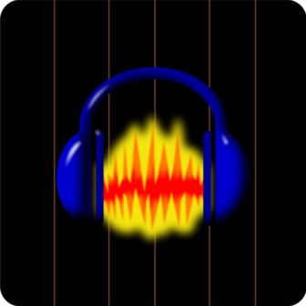

<div align="center">



# Audacity2Guidelines

**Import Audacity label tracks and generate BPM-synced guidelines in the GD editor**


</div>

---

## What is this?

**Audacity2Guidelines** brings two powerful tools directly into the GD Guideline Creator:

- 🎵 **Import Audacity labels** — export your label track from Audacity and import it straight into GD
- 🥁 **BPM Generator** — generate mathematically precise guidelines from BPM, with support for beat subdivisions and millisecond offset

## Features

- Import `.txt` label files from Audacity
- Generate guidelines by BPM with custom divisors
- Colored guidelines based on label names (`orange`, `yellow`, `green`)
- Millisecond offset support for perfect sync
- Saves generated labels back as `.txt` for Audacity
- Remembers your last used BPM settings

## How to use

### Import from Audacity
1. In Audacity, add labels to your track
2. Name them `orange`, `yellow`, or `green` for colored guidelines
3. Export: **File → Export → Export Labels**
4. Open a level in the **GD Editor**
5. Go to **Guidelines Creator** → click **"Import Audacity"**
6. Select your `.txt` file

### Generate BPM Guidelines
1. Go to **Guidelines Creator** → click **"Generate BPM"**
2. Fill in BPM, Start, End, Divisors and Offset
3. Click **Generate** and save the `.txt` file

## Divisors

| Divisor | Color | Description |
|---|---|---|
| 1 | 🟠 Orange | Every beat |
| 2 | 🟡 Yellow | Half beats |
| 4 | 🟢 Green | Quarter beats |

## Build

```sh
geode build
```

## Credits

Made with ❤️ by **jodiexpress**

## Credits

Made with ❤️ by **jodiexpress**
